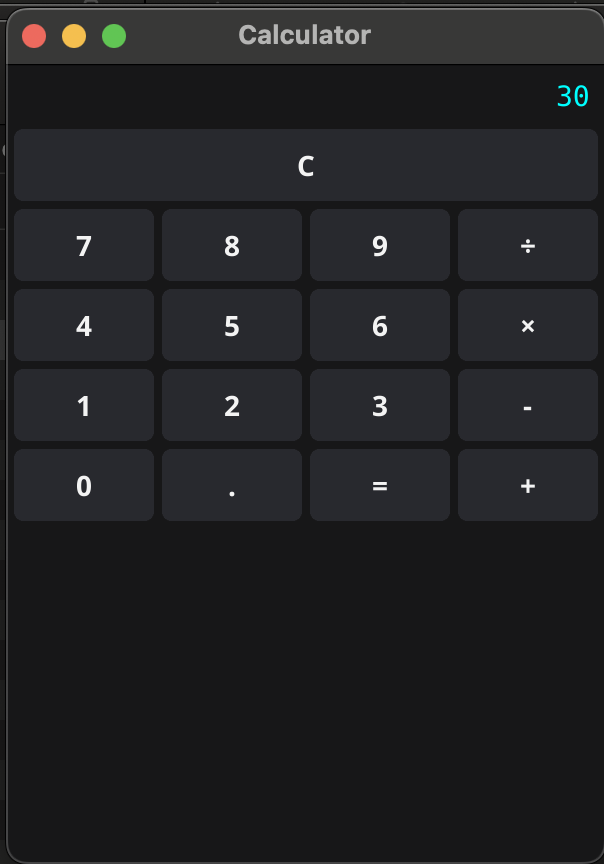

# Todo App with Fyne


A modern Todo application built with Go and Fyne framework, featuring user authentication and task management with priority levels.

## Features

- User authentication (login system)
- Create, read, update, and delete tasks
- Priority levels for tasks (High, Medium, Low)
- Modern and responsive UI
- Cross-platform support

## Prerequisites

- Go 1.16 or higher
- Fyne dependencies:
  - For macOS: Xcode Command Line Tools
  - For Linux: gcc and X11 development files
  - For Windows: gcc (MinGW)

## Installing Fyne and Dependencies

1. **Install Go:**
   - Download and install Go from [https://golang.org/dl/](https://golang.org/dl/)

2. **Install Fyne:**
   ```bash
   go install fyne.io/fyne/v2/cmd/fyne@latest
   ```

3. **Install platform dependencies:**
   - **macOS:**
     ```bash
     xcode-select --install
     ```
   - **Linux (Debian/Ubuntu):**
     ```bash
     sudo apt install gcc libgl1-mesa-dev xorg-dev
     ```
   - **Windows:**
     - Install [MinGW](http://www.mingw.org/)

## Installation

1. Clone the repository:
```bash
git clone https://github.com/imratnesh/fyne_learn.git
cd fyne_learn
```

2. Install dependencies:
```bash
go mod download
```

## Running the Todo Application

To run the application:
```bash
cd crud_todo_app
go run main.go
```

Default login credentials:
- Username: ratnesh
- Password: ratnesh

## Running the Calculator



To run the calculator:
```bash
go run calculator.go
```

## Project Structure

```
crud_todo_app/
├── database/         # Database operations
│   └── db.go
├── ui/              # User interface components
│   ├── login.go     # Login page
│   └── todo.go      # Todo list page
├── main.go          # Application entry point
└── go.mod           # Go module file
calculator.go        # Calculator app
crud_todo_app/calculator.png # Calculator screenshot
```

## Building for Different Platforms

To build the application for different platforms:

```bash
# For macOS
cd crud_todo_app
go build -o todo-app

# For Windows
cd crud_todo_app
GOOS=windows GOARCH=amd64 go build -o todo-app.exe

# For Linux
cd crud_todo_app
GOOS=linux GOARCH=amd64 go build -o todo-app
```

## Contributing

Feel free to submit issues and enhancement requests!

## License

This project is open source and available under the MIT License.
